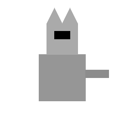

<p align="center">
  
</p>

<h1 align="center">🌙 Lumine Radar Logger</h1>

<p align="center">
  <b>Lightweight Radar Event Logger for Lumine Proxy (Minecraft Bedrock)</b><br>
  Session-based radar logging • Spatial dedupe • Low CPU • Standalone EXE
</p>

---

# 🚀 Overview

**Lumine Radar Logger** is a lightweight Windows utility that reads Lumine Proxy radar output directly from your **Minecraft Bedrock chat window**.

It creates **clean, filtered session logs** while keeping your main gameplay unaffected.

---

# ⚠️ IMPORTANT — READ BEFORE USING

This logger is designed for an **idling account**.

It works by reading Lumine’s radar output directly from your Minecraft chat window.

> ❗ **Chat MUST remain open at all times**  
> ❗ **It will NOT work if chat is closed**

Because Lumine Radar continuously outputs events to chat, running this on your main account while playing is **not recommended**.

> 🔮 A future update may support background logging without chat being open soon.

---

# ⚙️ Required Minecraft Settings

For coordinate accuracy, the following settings are **mandatory**.

---

## 📝 Chat Settings

Open Chat → Click the ⚙️ (Cogwheel)

Set the following:

| Setting        | Required Value |
|---------------|----------------|
| Font          | **Noto Sans**  |
| Size          | **12**         |
| Line Spacing  | **x1.0**       |

---

## ♿ Accessibility Settings

Open **Minecraft Settings → Accessibility**

Set:

| Setting | Required Value |
|----------|----------------|
| GUI Scale Modifier | **-1** |

These values ensure consistent pixel rendering for accurate OCR coordinate extraction.

---

# 🛠 How To Use

1. Start a **Lumine Proxy Server** 
2. Join the server server  
3. Ensure `/.radar` is enabled  
4. Open chat and **KEEP IT OPEN**  
5. Run **Lumine Radar Logger**  
6. Select the Chat View Area  
7. Click **Start**  

---

# 📁 Logs

Logs are created **per session**.

A `logs/` folder is automatically generated in the same directory as the `.exe`.

Each session creates:

```
logs/session_YYYY-MM-DD_HH-MM-SS.log
```

---

# ❌ It Will NOT Work If

- Chat is closed
- Font is not **Noto Sans**
- GUI Scale is not **-1**
- Chat size differs from required values
- Radar is not enabled
- The Chat View Area is selected incorrectly

---

# 🛡 Security Note

This application:

- ❌ Does NOT inject into Minecraft
- ❌ Does NOT modify memory
- ❌ Does NOT hook processes
- ✅ Only reads screen pixels

---

# 🧠 How It Works

The logger:

- 🧾 Extracts event type + coordinates from chat
- 🔍 Uses spatial deduplication
- 📍 Applies spatial filtering to prevent spam
- 🗂 Creates clean session-based log files

All processing is:

- ✅ 100% Local  
- ✅ No network transmission  
- ✅ No Minecraft modification  

---

# 📦 Distribution

The distributed ZIP contains:

```
LumineRadarLogger.exe
```

> No additional installs required.

---

# 🔮 Planned Features

- Background logging without chat open  
- CSV export  
- Event-type filtering  
- Heatmap generation  
(Possibly an entire rewrite to move to an entirely different logging system)
---

# 📜 License

Personal use tool built for Lumine Proxy radar users.

---

<p align="center">
  <b>🌙 Created by Baynav with Love &lt;3</b>
</p>
